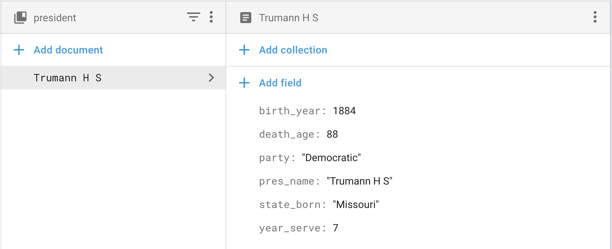

# SQL and NoSQL Database comparison

This is an assignment on the subject; Information Systems and Databases. In this assignment, 
Firebase Cloud Firestore is selected to be compared with SQL database.

#### Group Members
- Arut Jinadit 60090002
- Pasuta Paopun 60090025
- Napop Soontrapong 60090019

## Introduction to Cloud Firestore

### Firebase Cloud Firestore
According to Cloud Firestore documentation site, it is a flexible, scalable database for mobile, web and 
server development from Google's Firebase and Google Cloud Platform (GCP). Moreover, the Cloud Firestore
provides syncing functionality to client apps through real-time listeners and as well as offers offline support
for mobile and web apps.

In fact, Cloud Firestore is actually a service which allows developers to perform rapid application development.
Instead of an actual 3-tier application development, Cloud Firestore binds the server-sided service with database. So, 
developers could use Firestore as an API service in accessing data via either Firestore Client SDK or Firestore Admin SDK.  

## Get started with Cloud Firestore
When developing any application with Firestore, there are some few steps those are required as a prerequisite.
### 1. Create a Cloud Firestore project on Firebase console.
Since Firestore is one of Firebase products, developers have to create a Firebase project to use Firestore.
This can be done on [Firebase console](https://console.firebase.google.com). 
### 2. Set up development environment
Firestore provides several SDK on many languages so developer may choose the one that they are familiar with.
But in this particular example, we'll illustrate the Firestore usage with a the javascript SDK for web.
### 3. Initialize a Cloud Firestore instance.
When using Firestore in the app, an instance of Firestore has to be created. This step can be done by
the following code-fragment.

```javascript
// Initialize Cloud Firestore through Firebase
firebase.initializeApp({
  apiKey: '### FIREBASE API KEY ###',
  authDomain: '### FIREBASE AUTH DOMAIN ###',
  projectId: '### CLOUD FIRESTORE PROJECT ID ###'
});

const db = firebase.firestore();
```

## Cloud Firestore Data Model
Before illustrating comparisons features between SQL approach and Firestore, we would like to show 
how data in Firestore are structured.

Cloud Firestore is a NoSQL, document-oriented database. Instead of storing data in the tabular-manner, 
data are actually be kept in **_documents_** which are also be organized into **_collections_**.

### Documents
In SQL, a row of a table represents a fact with predefined-integrity. In contrast, Cloud Firestore represents
a fact in the form of documents. In each document, it is contained with fields which map to values and can be 
considered as attributes. Moreover, each document can be identified by its name and the name of each document
in the same collection has to be unique.

For example, a document representing the fact of a president **Trumann H S** shall be looked like this.



From the example, a document is similar structured like a JSON (Javascript Object Notation) record.
In fact, it is but with a few differences. In development, it can be treated as a JSON object.

### Collections
For Cloud Firestore, a collection acts like a container for documents to live in. It is similar to tables
in SQL which contains facts. Since the Cloud Firestore is schemaless, document format can be different 
even they are in the same collection but using the same structure for documents which are contained in the same collection
is suggested in order to perform easier document querying.

## Features Comparison
In the next topic, we will be discussing on Cloud Firestore features in compare with SQL features.
These following topics will be focused.

- Selecting all or particular columns from one table
- Selecting specified rows from on a table 
- Built-in functions 
- Calculations 
- The grouping feature 
- Selecting columns and rows from several tables 
- Subqueries 
- Use more than one copy of a table  
- Correlated subqueries [todo]
- Subqueries with testing for existence [todo]
- Views [todo]

Basically when performing queries in Cloud Firestore, a reference to the specific a document or a collection
has to be identified. Then, we use a identified-reference to query. 

### Selecting all or particular columns from one table
For querying all attributes from documents, it can be done easily.

```javascript
//Create a reference to the "president" collection 
const presidentRef = db.collection("president")

//Perform documents query
const query = presidentRef.get()
```

For querying with Firestore, it cannot select particular columns in the documents. It has to be done 
in the application logical business. 

```javascript
//Create a reference to the "president" collection
const presidentRef = db.collection("president")

//Perform documents query
const query = presidentRef.get()

//Filter the required-attributes from each document using Javascript
const result = (async () => {
    return await query.then( (snapshot) => {
        return snapshot.map(document => {
            const data = document.data()
            return {
                id: document.id,
                data: {
                    'pres_name': data['pres_name'],
                    'birth_year': data['birth_year']
                }
            }
        })
    })
})
```

For ``ORDER BY`` feature in SQL, it can be done in Cloud Firestore as in this example.

```javascript
//Create a reference to the "president" collection
const presidentRef = db.collection("president")

//Perform documents query with "order by" in ascending order 
const query = presidentRef.orderBy('pres_name').get()

//Perform documents query with "order by" in descending order 
const query = presidentRef.orderBy('pres_name', 'desc').get()
```

### Selecting specified rows from one a table
In Cloud Firestore manner, it would be said as selecting specified document from a collection.
For operations which are using in Firestore query, those are similar to operations in SQL.
These following operations are supported:

- equal to (==)
- greater than or equal to (>=)
- less than or equal to(<=) 
- greater then (>)
- less than (>)

But in contrast, Firestore doesn't support ``OR`` logical operation. When the ``AND`` logical operation
is needed, it can be done using this following code-snippet as well as ``LIKE`` operation, it is not yet 
support.-

```javascript
//Create a reference to "president" collection
const presidentRef = db.collection("president")

//Perform documents query with "where" clause
const query = presidentRef
                    .where("state_born","==","Missouri")
                    .where("death_age","<=","80")
```

### Built-in functions
For SQL built-in functions like ``AVG``, ``SUM``, ``MIN`` and etc., those are not implemented in Cloud Firestore. To do so, 
we needs to implement those functions as one of the business logic in the application. For example, the ``COUNT`` function 
can be simply implemented using the following code-fragment.

```javascript
//Create a reference to "president" collection
const presidentRef = db.collection("president")

//Perform documents query.
const count = (async () => {
    return await presidentRef.get().then(snapshot => snapshot.docs.length)
})()
``` 

### Calculation
In SQL,  there arithmetic calculation functions to be used with numeric data types. 
However, Cloud Firestore does not provide those. Developers have to do so in the application business logic.
To illustrate more, we show to find the average of presidents age. 

```javascript
//Create a reference to "president" collection
const presidentRef = db.collection("president")

//Perform documents query.
const query = presidentRef.get()
const average = (async () => {
    return await query.then(snapshot => {
        const count = snapshot.docs.length
        const sum = snapshot.docs.reduce((currentResult, nextNumber) => currentResult + nextNumber, 0)
        return sum / count
    })
})
```

### The grouping feature
In Cloud Firestore, it does not have such feature. You have to implement it yourself.

### Selecting columns and rows from several tables tables: Joining
Joining in Cloud Firestore does not exist. Alternatively, when designing collections which are related, duplicating data is suggested.
For example, in SQL when a user orders some food, it may use three tables; User, Food, Order. Then, when a list of food's prices that are
contained in the order is needed, it can be obtained by using some SQL join. In contrast, Firestore document suggests that 
, in this case, you may have three collections but documents in the order collection may contain some necessary field from a user and 
foods that are associated with it. 

### Subqueries
For subqueries, Firestore does not have any particular method to support. However, it can be done by query each demand separately.
For instance, to list all document about those marriages which have more than the average children could be done by the following snippet.

```javascript
//Create a marriage collection reference
const marriageRef = db.collection("pres_marriage")
//Find documents which meet the criteria
const marriagesHavingChildrenAboveAverage = (async () => {
    return await marriageRef.get()
            .then(snapshot => {
                //Get total number of marriages.
                const numberOfMarriages = snapshot.docs.length
                //Get an average number of children in all marriages.
                const averageChildren = snapshot.docs.reduce((currentSum, nextNumber) => {
                    return currentSum + nextNumber
                }, 0) / numberOfMarriages
                //Filter out documents which have the number of children less than or equal to the average. 
                return snapshot.docs.filter((marriageDoc) => marriageDoc["nr_children"] > averageChildren)
            })
})()
```    

### Use of more than one copy of a table
For this feature, as in Firestore does not support the subquerying feature, this feature is not included as well. 
As an alternative, it can be done similar to the example in the subqueries section.

### Correlated subqueries
As we have discussed earlier, Cloud Firestore does not support the subquerying feature as well as the aggregation functions. 
Hence, when a developer has to perform a query as same as in SQL which requires correlated subqueries, it has to be done
with a helping of client-sided business logic.

### Subqueries with test for existence
As a consequence for not having subqueries as one of the features, this demand will be delegated to the client side.
To illustrate, listing the names and ages at death of all presidents who married can be accomplished by this code-fragment.

```javascript
//Create a reference to the marriage collection
const marriageRef = db.collection("pres_marriage")

//Get all documents in the marriage collection
const marriageDocs = (async () => {
    return await marriageRef.get().then(snapshot => snapshot.docs)
})()

//Create a reference to the president collection
const presidentRef = db.collection("president")

//Get married presidents
const marriagedPresident = (async () => {
    //Get the latest snapshot from Firestore
    return await presidentRef.get().then(snapshot => {
        //Filter out documents from president who does not appear in the marriage collection.
        return snapshot.docs.filter(presidentDoc => {
            const presNameList = marriageDocs.map(doc => doc.data()['pres_name'])
            return presNameList.includes(presidentDoc.data()['pres_name'])
        })  
    })
})()
```

### Views
In Firestore, it does have something similar to this. As shown above in the previous section, documents in a collection
can be queried first and then, be used in another document query as well. 

## Conclusion
For rapid application development, using Firestore may shorten the development time by reducing server side and database set up.
Hence, developers just use Cloud Firestore SDK plug-and-play with their application. Developers can also define shallow integrity rules
within Firestore collections by defining [security rules](https://firebase.google.com/docs/firestore/security/get-started). Thus, Cloud Firestore has 
real-time listeners to let the application has the same set of data across devices as well as the offline-supported feature 
to allow the application to be working seamlessly with low network connectivity. 

However, Cloud Firestore is very flexible according to its schema-less characteristic. Therefore, data duplications are allowed.
Moreover, most of the calculations are delegated to the application side which may produce more complexity in the application's code. 

In conclusion, Firestore is great for developing an application with a short period of time. But it will produce the technical debt
in the technical development as well, due to its schema-less behavior. Therefore, Cloud Firestore could be used with SQL database 
to ensure the data integrity. Moreover, with Cloud Firestore real-time and offline-supported feature, it would empower
SQL to have more capability in working with users whose network connectivity is low and let data be synced across devices.
   


